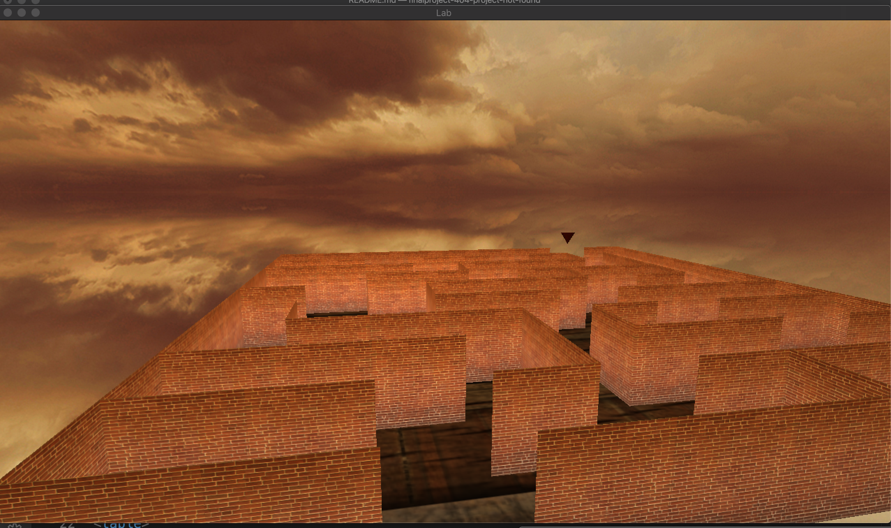
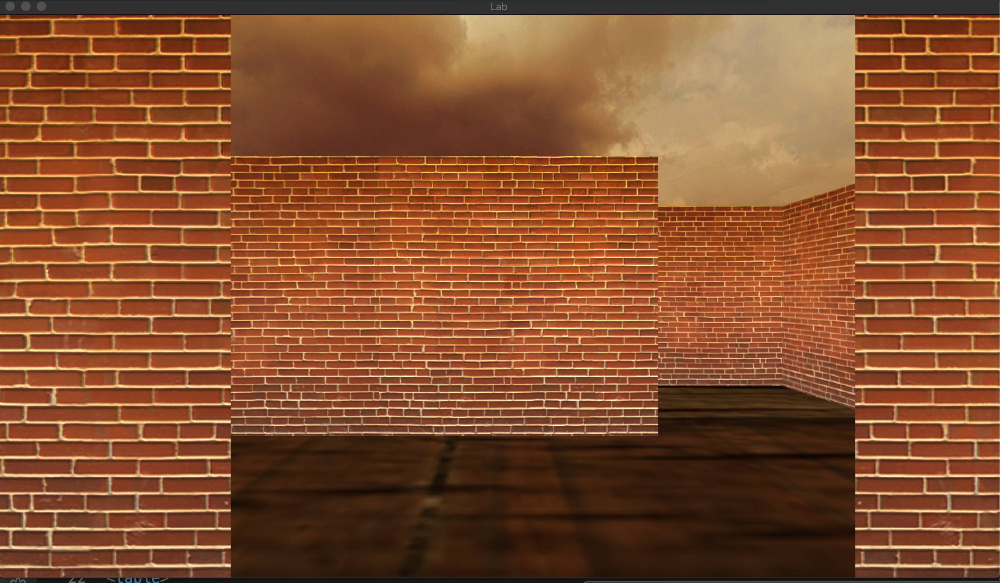

## Edit this line: Put your link to your youtube video here (see deliverables).

## Screenshots.
The maze overview from the starting point - 

When the program starts

When the program ends

* Name and partners name(At most teams of 2 folks total)
  * Team member 1: Nithin Gangadharan
  * Team member 2: Wei-Li Huang
* How many hours did it take you to complete this final project? 
  * Collectively about 40 hours of work
* Did you collaborate or share ideas with any other students/TAs/Professors?
  * Midway through the project, the professor provided some inputs which we incorporated into the project
* Did you use any external resources? 
  * Note it is fair to utilize some tutorials--cite them here. You **must** add your own personal touch however!

  * Collision detection - https://learnopengl.com/In-Practice/2D-Game/Collisions/Collision-detection
    * Ended up doing bounded-box collision detection

  * Adding a sky-box - https://learnopengl.com/Advanced-OpenGL/Cubemaps
    * The image resource for the Skycube image was picked from here - https://opengameart.org/content/cloudy-skyboxes
    

  * Syncing camera with mouse and keyboard movements - https://learnopengl.com/Getting-started/Camera
    * In the labs and assignments, the camera, mouse and keyboard were not exactly in sync. Looking to the right (using the mouse) and pressing forward (using the keyboard) would not make the camera move in the direction where the camera is looking at. We used this resource to fix that problem.

  * Smoothing the camera movement - https://stackoverflow.com/a/44432317/1518924
    * When holding down on a key, SDL sends the key-down events with a bit of a delay between them. In that delay, there would be multiple render calls that happen. This is the reason why the camera movement seemed uneven. 
    * The above link, was the starting point to find the solution, and helped put us in the right direction.

  * Animating an object - https://learnopengl.com/Getting-started/Shaders
    * Although the above link changes the color dynamically, we used the same principle to animate objects.

  * (Optional) What was the most interesting part of the Final Assignment? How could the instructor improve the final project?
    * Interesting parts - 
      * Collision Detection - This was the pretty challenging since we had no clue on the best way to do this. We settled on the bounding box method. This was effective and worked well.
      * Representing a maze - This was definitely challenging, since it took quite some time to figure out the best way to represent a maze and to map it to the OpenGL coordinate system.
      * Smoothing the camera movement - The camera movement was very laggy, and we spent sometime to figure out the best way to do it. Leveraging the key-up and key-down events worked best for this project!
      * Skycube - Adding the sky-cube into the existing abstraction was a bit of struggle. Also, the orientation of sky-cube images we pretty different. We had to rotate quite a few images to get the correct configuration.

    * Improvements - 
      * Our maze is basically a static one. We had an intention of randomly generating a maze every time this program is run. We did not do it, primarily due to time constraints, and we wanted to work on more graphics-related aspects of the project.
      * Add Sliding collision - Right now, when brushing against the wall, the camera stops. Using sliding collision would avoid that.
      * Adding a sound whenever the camera moves

### Rubric

<table>
  <tbody>
    <tr>
      <th>Points</th>
      <th align="center">Description</th>
    </tr>
    <tr>
      <td>(33.3%) Project Completion</td>
     <td align="left"><ul><li>Does the project compile and run.</li><li>Is it polished without any bugs (No weird visual artifacts).</li><li>Did you make a video?</li><li>Did you add a screenshot of your project to the repository?</li></ul></td>
    </tr>
    <tr>
      <td>(33.3%) Technical</td>
      <td align="left"><ul><li>Was the implementation of the project challenging?</li><li>Even if you followed a tutoral, it should not be trivial, and have some personal touch to it.</li><li>Did you have to organize/process a sufficient amount of data?</li><li>Was it clear you consulted some outside resources that go above and beyond the scope of this class</li></ul></td>
    </tr>
    <tr>
      <td>(33.4%) Creativity</td>
      <td align="left"><ul><li>How visually appealing is the scene?<ul><li>Note: There should be some 'wow' factor--instructors discretion is used here.</li></ul></li><li>How original is the project<ul><li>Again, did you enhance a tutorial and do something unique or just go by the book?</li></ul></li></ul></td>
    </tr>
  </tbody>
</table>
