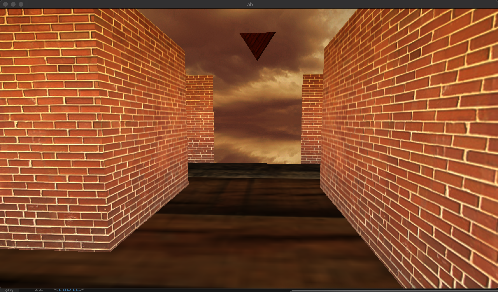

# Maze 3D

This is a simple maze game written in OpenGL. The objective of the game is to reach the end of the maze.

NOTE: This was done as a final project for the subject Computer Graphics. Some of the starter code was written by the professor, while the rest of it was written by me and my project partner.

## Video link
https://www.youtube.com/watch?v=nXODF0Ps1uM

## Screenshots

When the game starts - 

The entire maze in the "Peek view" -

At the finish line -

### Features
- Aim of our project was to create a 3-D maze, much like the old game Wolfenstein-3D (1992)
- Maze representation of walls
- Collision detection (Bounding-box)
- Sky-cube
- Smoothing movements
- Normals implementation on walls
- Lighting
- Animated finish point indicator

### Keyboard/Mouse controls
- You can turn around horizontally using the mouse.
- `w` or `↑` - Move Forward
- `s` or `↓` - Move back
- `a` or `←` - Move left
- `d` or `→` - Move right
- `q` - Look up
- `e` - Look down
- `p` - Peek view - Camera is hoisting above the maze. You can still turn around, but moving forward or backward is disabled.
- `esc` - Quit the game

## Contributors

* [Nithin Gangadharan](https://github.com/gnithin)
* [Wei-Li Huang](https://github.com/Wei-LiHuang)
* [Mike Shah](https://github.com/MikeShah)

## External resources 
  * For Collision detection - https://learnopengl.com/In-Practice/2D-Game/Collisions/Collision-detection
    * Ended up doing bounded-box collision detection
  * Adding a sky-box - https://learnopengl.com/Advanced-OpenGL/Cubemaps
    * The image resource for the Skycube image was picked from here - https://opengameart.org/content/cloudy-skyboxes
    * This was a pretty awesome effect!
  * Syncing camera with mouse and keyboard movements - https://learnopengl.com/Getting-started/Camera
  * Smoothing the camera movement - https://stackoverflow.com/a/44432317/1518924
    * When holding down on a key, SDL sends the key-down events with a bit of a delay between them. In that delay, there would be multiple render calls that happen. This is the reason why the camera movement seemed uneven. 
    * The above link, was the starting point to find the solution, and helped put us in the right direction.
  * Animating an object - https://learnopengl.com/Getting-started/Shaders
    * Although the above link changes the color dynamically, we used the same principle to animate objects.

## TODO/Improvements
* Our maze is basically a static one. We had an intention of randomly generating a maze every time this program is run. We did not do it, primarily due to time constraints, and we wanted to work on more graphics-related aspects of the project.
* Add Sliding collision - Right now, when brushing against the wall, the camera stops. Using sliding collision would avoid that.
* Adding a sound whenever the camera moves (I want "Jump in the Fire" by Metallica)